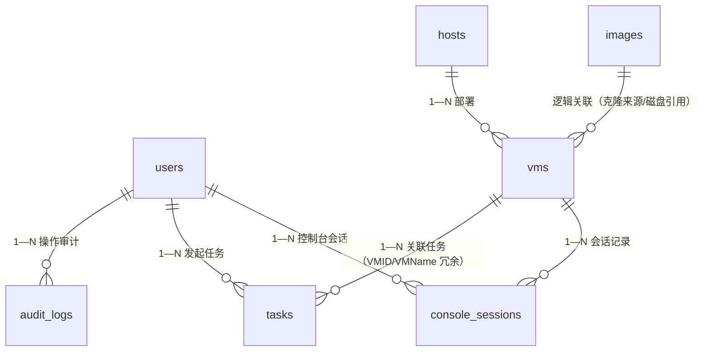

# 数据库设计

> 对应论文章节：第四章 总体设计（数据模型部分）。
> 素材来源：旧《数据库设计》全文、model/*.go 定义、database.Init() AutoMigrate。

[TOC]

------

## 1. 设计原则

- 10 张核心表覆盖 KVM 管理、异步任务、会话跟踪与运维闭环功能（含后期新增的 pool_meta 池元数据、alerts 告警历史）。
- 软删除（`DeletedAt`，任务表与会话表为运行记录、采用硬删除/终态标记而非软删除）、外键约束 + 级联、适当冗余（`username`、`vm_name` 便于列表展示）。
- 建表与种子数据不依赖手工 SQL（`AutoMigrate` + `initSeedData`）。
- 任务 `Payload` 内部使用、不返回前端；会话 `Token` 内部关联、不返回前端。

## 2. ER 图

## 3. 表结构

### 3.1 users 表

| 字段 | 类型 | 约束/说明 |
|---|---|---|
| id | uint | 主键 |
| username | varchar(50) | 唯一索引，非空 |
| password_hash | varchar(255) | bcrypt 哈希，不返回前端 |
| role | varchar(10) | `admin` / `viewer`，默认 `viewer`。`viewer` 为**完全只读**：读接口 + 图形控制台只读观看，变更操作与 SSH/串口控制台均 403 |
| is_active | bool | 默认启用；置 false 后鉴权阶段即 403「账号已被禁用」 |
| real_name / phone / email | varchar | 展示信息 |
| last_login | datetime nullable | 登录时更新 |
| created_at / updated_at / deleted_at | 时间戳 | 软删除索引 |

种子账号：`admin/password`（admin）、`user/123456`（viewer）。明文口令不写入启动日志（只打用户名与角色），首次登录后应立即修改。

> `password_hash` 是本表最敏感的列。改造前带 `:id` 的查询接口把路径参数直传 ORM，攻击者可经内联条件退化出的原始 SQL 做布尔盲注读取该列（且只读角色即可达）；现路径参数主键统一解析为数值后才进入查询，见 docs/05 §6.11.1。

### 3.2 hosts 表

| 字段 | 说明 |
|---|---|
| name、ssh_ip、ssh_port、ssh_user | 登记信息。`ssh_ip` 写入前须过格式校验（IP 或保守主机名白名单）——该值会作为 argv 传给 `ping`，以连字符开头的取值会被当成命令选项，见 docs/05 §3 |
| status、cpu_cores/memory_gb/disk_gb、description | 状态采集与描述。`status` 取 `unknown / reachable / unreachable`，由连通性测试回写 |

> 定位是「宿主机登记与状态采集」：登记 SSH 信息用于连通性探测（ping）、关联 vms 做资源归属。早期版本曾在此放 `libvirt_uri` 字段冒充多宿主机纳管，因从未用于建立连接已移除（`os_version` 死列同批清理）；虚拟化连接固定为本机 `qemu:///system`。

### 3.3 vms 表

| 字段 | 类型 | 约束/说明 |
|---|---|---|
| id | uint | 主键 |
| uuid | varchar(36) | 唯一索引（libvirt 域 UUID） |
| name | varchar(100) | 非空 |
| host_id | uint | 外键索引，关联 hosts |
| storage_pool | varchar(100) | 默认 `vmops` |
| vcpu | int | 默认 1 |
| memory_mb | int | 默认 1024 |
| disk_gb | int | 默认 20（多盘累计） |
| ip | varchar(45) | 兼容 IPv6 长度；由 DHCP 租约 + qemu-guest-agent 双通道在列表/详情请求时自动回填（30s 节流），无手工编辑入口 |
| mac_address | varchar(17) | 首网卡 MAC |
| status | varchar(20) | 默认 `shut off`，仅 `running / shut off / paused / error`（经 `StateToPlatform` 映射） |
| os_type | varchar(50) | 如 `hvm` |
| description | text | 描述 |
| created_at / updated_at / deleted_at | 时间戳 | 软删除索引 |

状态枚举与 virsh 状态映射（`running/shut off/paused/error`）由 virt 层统一转换，与 `vms.status` 一致。

> `status` 列默认值曾与该映射不一致：模型里写作 `shut_off`（**下划线**），而 `StateToPlatform` 返回
> `shut off`（**空格**），前端亦按空格版本做颜色与文案映射——一旦某行落到列默认值，其状态在前端将匹配
> 不到任何已知状态。P2 已把默认值改为 `shut off`，并新增两套常量（`model.VMStatus*` 与 `virt.Status*`）
> 供各层引用，杜绝字面量散落（gorm tag 内不能引用常量，故该处字面量须与常量手工同步，代码注释已注明）。
> 存量数据核查确认库中**没有** `shut_off` 的历史行（所有写入路径都显式给出状态值，从未落到列默认值）；
> GORM `AutoMigrate` 可修改已有列的默认值，后端重启即收敛，无需手工 DDL。详见 docs/05 §6.12。

### 3.4 images 表

| 字段 | 类型 | 约束/说明 |
|---|---|---|
| id | uint | 主键 |
| name | varchar(100) | 非空 |
| path | varchar(500) | 非空，卷落盘路径。**该路径可能同时被虚拟机引用**：「基于云镜像创建」（`disks[].source_image_id`）是直接引用镜像文件、不做拷贝，因此删除虚拟机时必须以本表的 `path` 集合作为守卫，避免删掉镜像本体而留下悬挂记录（见 docs/05 §6.7.3） |
| os_version | varchar(100) | 系统版本 |
| size_gb | float | 镜像大小 |
| format | varchar(20) | 默认 `qcow2` |
| is_template | bool | 默认 `false`；模板标记：`PUT /api/images/:id/template` 改写，`GET /api/images?is_template=true` 筛选，创建向导的云镜像选项即取模板 |
| description | text | 描述 |
| created_at / updated_at / deleted_at | 时间戳 | 软删除索引 |

### 3.5 audit_logs 表

| 字段 | 说明 |
|---|---|
| user_id（FK）、username（冗余） | 操作人 |
| action、object_type、object_id、detail | 操作类型/对象/详情 |
| source_ip、status | 来源与结果 |
| created_at | 记录时间 |

操作类型枚举覆盖登录、VM 生命周期、主机/镜像/存储/网络、暂停恢复、克隆、磁盘网卡挂卸、快照等（见仪表盘审计映射）。

### 3.6 tasks 表（异步任务记录）

对应 `model/task.go`，表名 `tasks`，无软删除（仅终态 `success/failed` 可经 `DELETE /api/tasks/:id` 清理）。

| 字段 | 类型 | 约束/说明 |
|---|---|---|
| id | uint | 主键 |
| type | varchar(50) | 索引；`create_vm / delete_vm / clone_vm / clone_image_vm / stop_vm` |
| title | varchar(200) | 如“创建虚拟机 smoke-01” |
| status | varchar(20) | 索引；`pending / running / success / failed` |
| progress | int | 默认 0，0–100，worker 经 `Report` 回写 |
| payload | text | 执行参数 JSON，内部使用，不返回前端 |
| result | text | 成功结果 JSON。`create_vm`/`clone_vm`/`clone_image_vm` 为 `{"vm_id":123}`；`stop_vm`/`delete_vm` 为 `{"vm":"名称"}`；`delete_vm` 另可能带 `kept_volumes`（字符串数组，被守卫刻意保留的共享卷及中文原因，见 docs/task-contract.md） |
| error | varchar(500) | 失败中文原因（截断 500 rune）。该字段**会回显前端**，故只存用户可见文案，原始错误链、panic 值与调用栈一律只进服务端日志。固定文案：`任务执行异常，请查看服务日志`（executor 或 worker panic）、`任务队列繁忙，请稍后重试`（入队超时）、`任务参数损坏，无法执行`（payload 反序列化失败）、`服务重启，未完成任务已终止，请重新提交`（启动收敛） |
| user_id | uint nullable | 发起人 |
| username | varchar(100) | 发起人冗余 |
| vm_id | uint nullable | 关联 VM（成功后回填） |
| vm_name | varchar(100) | 关联 VM 名冗余 |
| created_at / updated_at | 时间戳 | 无软删除 |

### 3.7 console_sessions 表（控制台会话记录）

对应 `model/session.go`，表名 `console_sessions`，记录“谁在何时以何种方式连了哪台 VM”。

| 字段 | 类型 | 约束/说明 |
|---|---|---|
| id | uint | 主键 |
| vm_id | uint | 索引，关联 VM |
| vm_name | varchar(100) | 索引，冗余便于展示 |
| user_id | uint nullable | 连接用户 |
| username | varchar(100) | 用户名冗余 |
| type | varchar(20) | 索引；`vnc / ssh / serial` |
| client_ip | varchar(45) | 来源 IP |
| status | varchar(20) | 索引；`active / closed` |
| token | varchar(100) | VNC token 内部关联，不返回前端 |
| started_at | datetime | 会话开始 |
| last_seen | datetime | VNC token 最近一次被 websockify 解析（存活心跳） |
| ended_at | datetime nullable | 会话结束 |

收敛语义：SSH/串口走后端 WS 桥，关闭时回写 `ended_at`；VNC 走 websockify 中转、后端看不到断开事件，靠 `TouchByToken` 刷新 `last_seen` + 清扫器（超 60 分钟无解析标 `closed`）收敛。SSH/串口的 WS 连接由 `console.Registry` 以写入串行化的 `*console.Conn` 形式持有，管理员强制断开经 `CloseWithReason` 发送带中文原因的关闭帧后再关连接。

角色约束：`type` 为 `ssh` / `serial` 的会话只可能由 admin 建立（只读角色在中间件层即被 403 拦下）；`vnc` 会话两种角色都可能建立，但只读角色的会话在客户端以 noVNC 只读模式加载。

### 3.8 system_settings 表（系统可写配置，UX 批次新增）

| 字段 | 类型 | 说明 |
|---|---|---|
| key | varchar(100) | 主键；白名单：`default_storage_pool` / `vnc_token_ttl_min` / `vnc_stale_min` |
| value | varchar(500) | 配置值（写入前经 service/setting 校验） |
| updated_at | datetime | 最近更新时间 |

收敛语义：与 config 包的环境变量静态配置互补——环境变量管「部署时确定」的项（数据库/JWT/端口），
system_settings 管「运行时可调」的项（经 `PUT /api/settings` 修改、保存即生效）。
消费方经包级 resolver 钩子实时读取，进程内缓存挡住高频查询。

### 3.9 alerts 表（告警历史，监控闭环批次新增）

对应 `model/alert.go`，表名 `alerts`。Alertmanager webhook 推回的告警按 fingerprint 去重入库，
firing/resolved 覆盖式更新同一行，供「监控中心 → 告警历史」追溯查询（与实时告警列表互补：
平台重启/AM 环形截断后实时列表查不到的告警，这里仍有记录）。

| 字段 | 类型 | 说明 |
|---|---|---|
| id | uint | 主键 |
| fingerprint | varchar(64) | 唯一索引；Alertmanager 对同一标签组合算出的稳定指纹，去重主键 |
| labels / annotations | text | 原始 JSON 文本（结构随规则变化，不建强类型列），查询时反序列化 |
| status | varchar(20) | `firing / resolved` |
| starts_at / ends_at | datetime | 告警开始/恢复时间。`ends_at` 必须用**指针**——firing 告警不携带该字段，值类型零值会写成 MySQL 零日期，严格 SQL 模式（NO_ZERO_DATE）下直接插入失败（实测 Error 1292） |
| created_at / updated_at | 时间戳 | 入库与最近更新 |

后台另有告警保留期清理任务，防止表无限增长。

### 3.10 pool_meta 表（存储池平台侧元数据，存储板块批次新增）

对应 `model/pool_meta.go`，表名 `pool_meta`。libvirt 池 XML 没有 description/role 字段，
池的「角色」（模板基盘/系统盘/数据盘等）与描述只能由平台自己存。

| 字段 | 类型 | 说明 |
|---|---|---|
| id | uint | 主键 |
| pool_name | varchar(64) | 唯一索引，关联 libvirt 池名 |
| role | varchar(20) | 空串 = 跟随自动推断（`handler.inferPoolRole` 按名称/路径推断，如 base→模板基盘） |
| description | varchar(500) | 池描述 |
| created_at / updated_at | 时间戳 | |

经 `PUT /api/storage/pools/:name/meta` 维护，存储池列表响应带 `pool_roles`。

## 4. GORM 模型定义

- `User / Host / VM / Image / AuditLog / Task / ConsoleSession / Setting / Alert / PoolMeta` 十模型，`TableName()` 逐字指定表名（`users / hosts / vms / images / audit_logs / tasks / console_sessions / system_settings / alerts / pool_meta`）。
- `database.Init()` 中 `AutoMigrate` 十模型自动建表（AutoMigrate 只加列不改删列，已删字段残留的物理列无害）；连接池 `MaxOpenConns=50、MaxIdleConns=10、ConnMaxLifetime=1h`。
- `main.go initSeedData` 在空库时创建 admin/viewer 种子账号；`Count`/`HashPassword`/`Create` 任一失败即打日志中止，避免写入空哈希造成账号静默不可登录，明文口令不进日志。

## 5. 索引与约束

| 表 | 索引 |
|---|---|
| users | `username` 唯一索引、`deleted_at` 索引 |
| vms | `uuid` 唯一索引、`host_id` 索引、`deleted_at` 索引 |
| images | `deleted_at` 索引 |
| tasks | `type` 索引、`status` 索引 |
| console_sessions | `vm_id`、`vm_name`、`type`、`status` 索引 |
| audit_logs | `action`、`created_at` 等查询索引 |
| alerts | `fingerprint` 唯一索引 |
| pool_meta | `pool_name` 唯一索引 |

---

## 📌 素材出处

- 旧《数据库设计》全文（表结构、字段说明、GORM 定义、种子逻辑）
- model/*.go（`task.go`、`session.go`、`vm.go`、`image.go`）、database/database.go、main.go initSeedData
